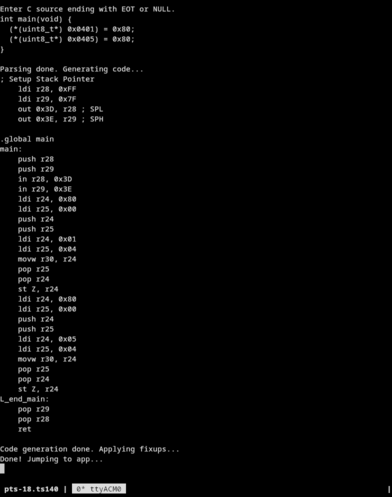

*Don't want to install a toolchain onto your computer to work with AVR chips?
Well I have just the thing for you!*

**D**ory's **C** **C**ompiler is a small, streaming C compiler and assembler
designed to run natively on the **AVR128DB28** microcontroller. It operates as
a bootloader, receiving C source code over UART and compiling it directly into
the application flash area.

- Runs both on host PC and natively on the AVR hardware.
- When running on the avr128db28, it acts as a bootloader that compiles C source
  via UART to machine code on the target chip and runs it.
- In its current state, uses less than 30KB of flash.

(Why AVR128DB28? That's the chip I have on hand)

## Hardware Configuration (AVR128DB28)

- **BOOTSIZE** fuse needs to be set to `0xC0` (96KB reserved for the bootloader,
  with 32KB for application code).
- **Clock** is hardcoded to 24MHz internal oscillator.
- **Communication** is hardcoded to USART2 @ 9600 Baud (pins PF0 and PF1).

The compiler supports a very small subset of C:
- Types: `int`, `void`, `uint8_t`, `uint16_t`.
- Memory-mapped IO via `struct` pointers and member access (`.`).
- Control Flow: `if/else`, `while`, `for`, `return`.
- Operators:
    - Arithmetic: `+`, `-`, `*`,
    - Logical/Bitwise: `&&`, `||`, `!`, `&`, `|`, `^`, `<<`, `>>`.
    - Comparison: `==`, `!=`, `<`, `>`, `<=`, `>=`.
    - Pointer: Dereference (`*`) and Address-of (`&`).
    - Increment/Decrement: `++`, `--`.
- Preprocessor: Simple `#define` macros (without arguments).

Notable limitations:
- x++ behaves exactly the same as ++x (they both return the new value)
- Integer division and any kind of floating point math.
- The compiler currently keeps the AST in internal SRAM, with each node taking
  up 50-70 bytes, practically limiting the amount of nodes to 150-250 nodes
  given the avr128db28's 16KB SRAM. Future expansion may include external SRAM
  support
- The compiler is not self-hosting and likely never will be: no AVR code can
  modify the code area it is currently executing from, and the boot section can
  only be modified by an external programmer

## Usage

### For PC

`make && ./dcc blink.c | ./dasm -h blink.hex`

The output hex or bin file can then be flashed with avrdude.

### For the AVR128DB28

0. Ensure you have the avr-gcc toolchain installed.
1. Modify `Makefile` for your setup of programmer and board.
2. `make avr && make load`
3. Connect to USART2 (TX=PF0, RX=PF1) at 9600 baud (`screen /dev/ttyACM0 9600`)
4. Send your C source code then end the transmission with a null byte (`\0`)
   or `Ctrl+D` if using `screen`.
5. The compiler will report progress and jump to the application.

The included `blink.c` test program rapidly altenates flashing PA7 and PC2.

